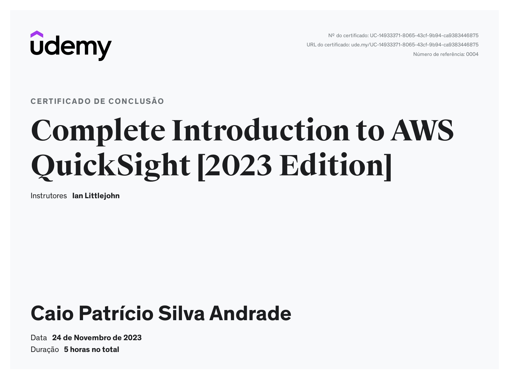

# 📌 Sprint 10 — Visualização de Dados com QuickSight

## 🎯 Objetivo
Finalizar o pipeline de dados com a criação de dashboards para análise e visualização utilizando Amazon QuickSight.

---

## 🧠 Conteúdos abordados
- Visualização de dados  
- Criação de dashboards interativos  
- Análise de dados na AWS  
- Apresentação de resultados  

---

## 📁 Exercícios

- [Dashboard do projeto](exercicios/Dashboard-desafio.pdf)  

---

## 📸 Evidências

- [Protótipo do dashboard](evidencias/Prototipo-desafio.pdf)  

---

## 📜 Certificados

---

## 📊 Resultado Final

- Dados processados e armazenados na AWS  
- Pipeline ETL completo implementado  
- Visualização de dados com QuickSight  
- Dashboard final para análise dos dados  

---

## 🚀 Conclusão

Este projeto simula um pipeline real de engenharia de dados, passando por todas as etapas:
- Coleta de dados  
- Processamento  
- Armazenamento  
- Análise  
- Visualização  
