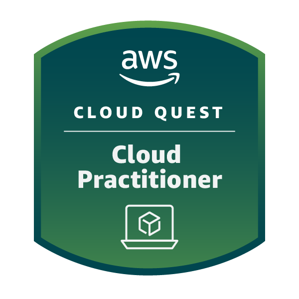

# 📌 Sprint 5 — Fundamentos de AWS Cloud

## 🎯 Objetivo
Compreender os conceitos de computação em nuvem e explorar os principais serviços e benefícios da AWS.

---

## 🧠 Conteúdos abordados
- Conceitos de Cloud Computing  
- Benefícios da utilização da AWS  
- Principais serviços da AWS  
- Fundamentos de arquitetura em nuvem  

---

## 📁 Exercícios

- [Accreditation (Technical) - Resumo](exercicios/Accreditation%20(Technical)%20resumo.txt)  
- [Cloud Economics Accreditation - Resumo](exercicios/Cloud%20Economics%20Accreditation%20resumo.txt)  
- [Sales Accreditation - Resumo](exercicios/Sales%20Accreditation%20resumo.txt)  

---

## 📜 Certificados

