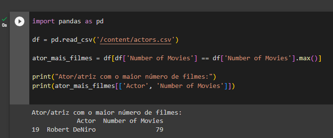
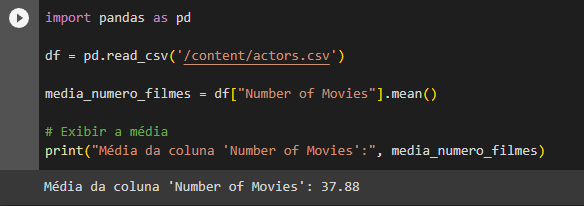
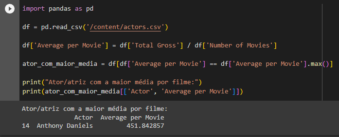
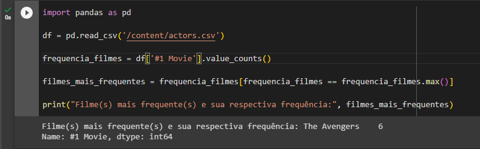
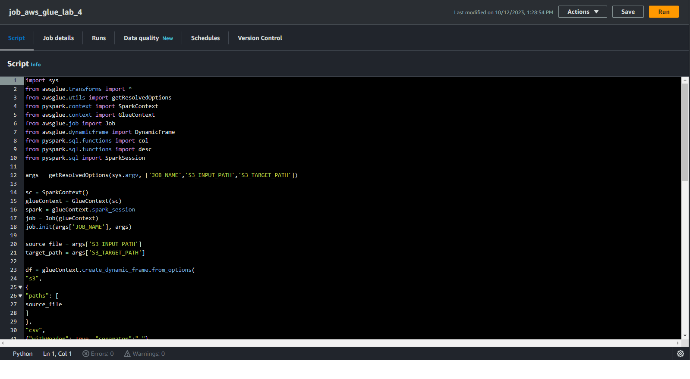
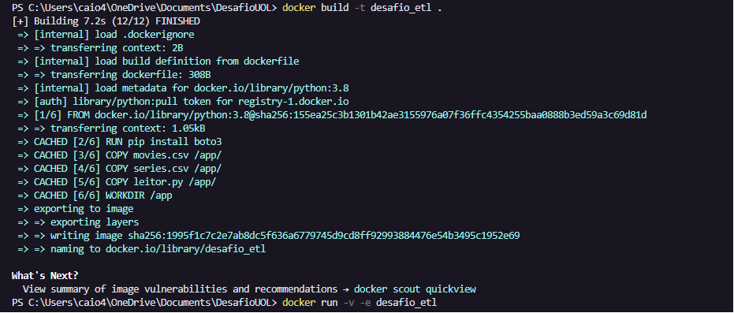
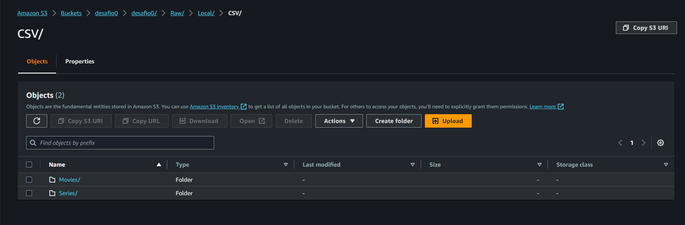
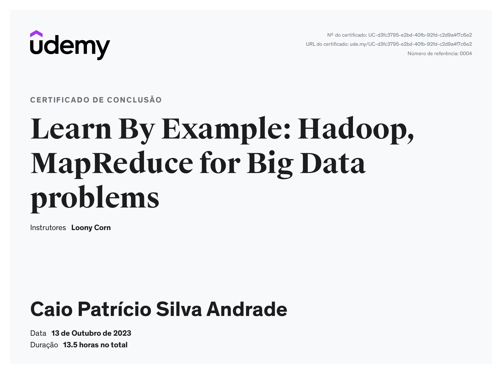

# 📌 Sprint 7 — Big Data com Spark e AWS Glue

## 🎯 Objetivo
Aplicar conceitos de Big Data utilizando ferramentas como Hadoop, Apache Spark e AWS Glue para processamento de dados.

---

## 🧠 Conteúdos abordados
- Conceitos de Hadoop  
- Processamento distribuído com Apache Spark / PySpark  
- Manipulação de dados com Pandas  
- Integração com AWS Glue  
- Execução de jobs e pipelines de dados  

---

## 📁 Exercícios

### 🔹 Pandas
-   
-   
-   
-   

### 🔹 Conteúdo teórico
- [Resumo Hadoop](exercicios/Hadoop.md)  
- [Resumo Spark](exercicios/Spark-Pyspark.md)  

### 🔹 Scripts e códigos
- [Código AWS Glue](exercicios/aws-Glue-codigo.py)  
- [Contador de palavras](exercicios/codigo-contador%20de%20palavras.py)  
- [Leitor ETL](exercicios/leitor.py)  
- [Dockerfile](exercicios/dockerfile)  

---

## 📸 Evidências

### ⚙️ Execução no AWS Glue

---

### 🐳 Docker e processamento

---

### 📊 Resultados

---

## 📜 Certificados

