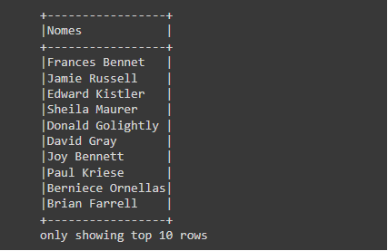
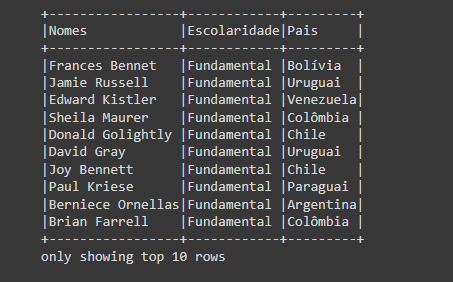
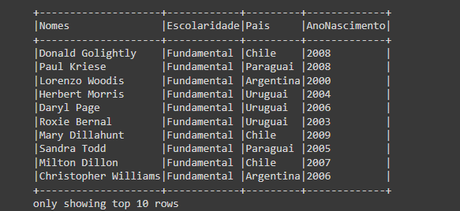
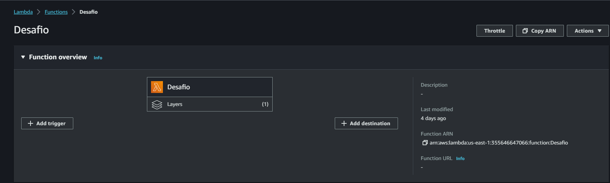
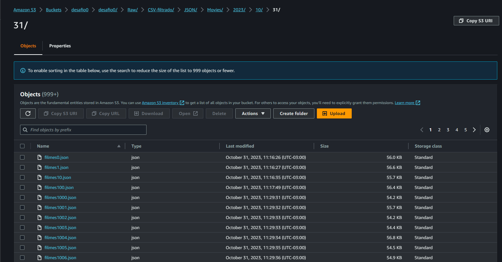
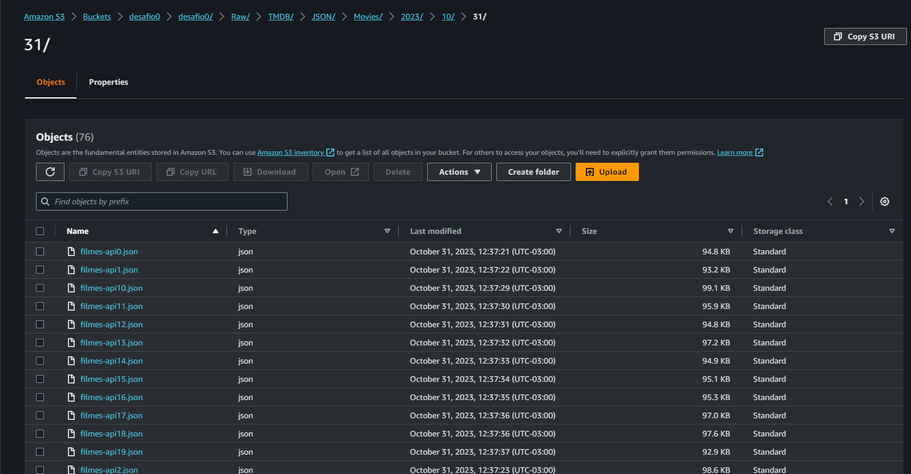
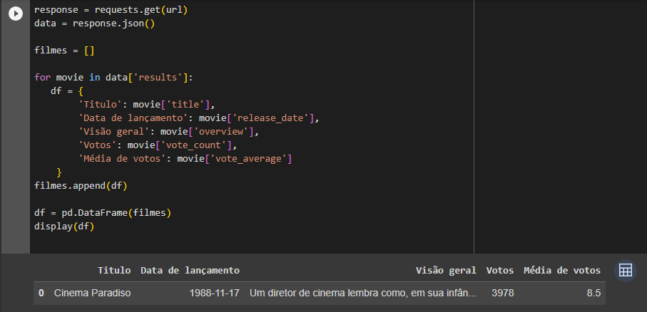
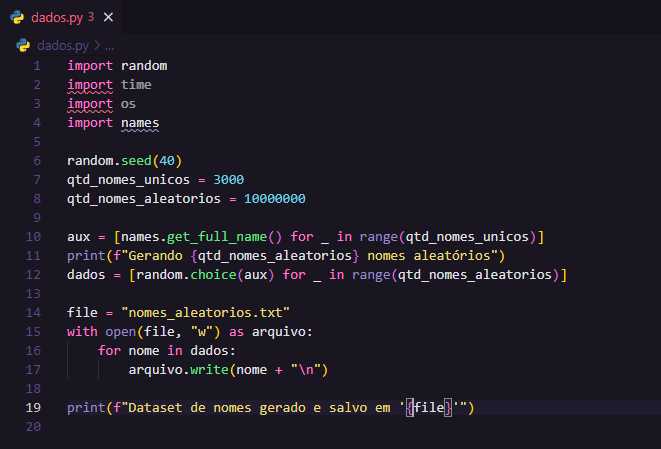
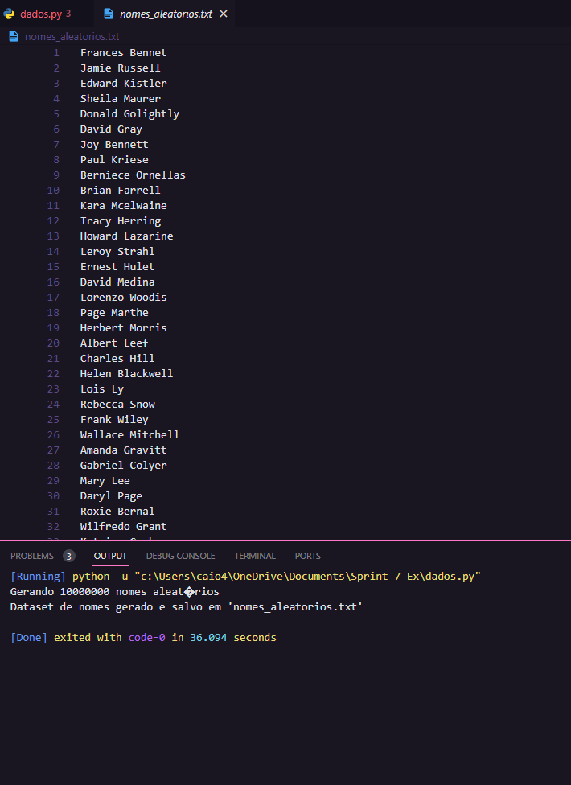

# 📌 Sprint 8 — Integração de Dados e ETL com API

## 🎯 Objetivo
Desenvolver e evoluir o pipeline de dados com integração de API externa, processamento com Python/PySpark e armazenamento na AWS.

---

## 🧠 Conteúdos abordados
- Consumo de API (TMDB)  
- Manipulação de dados com Python  
- Processamento com PySpark  
- Integração com AWS (Lambda e S3)  
- Continuação do pipeline ETL  

---

## 📁 Exercícios

- [Requisição API TMDB](exercicios/api-json.py)  
- [Processamento com Spark](exercicios/codigo-ApacheSpark.txt)  
- [Gerador de dados](exercicios/dados.py)  
- [Processamento CSV](exercicios/desafio.py)  
- [Warmup - lista de animais](exercicios/warmup.py)  

---

## 📸 Evidências

### 🔹 Processamento com Spark
  
  
  

---

### 🔹 Integração com AWS
  
  
  

---

### 🔹 Código e execução
  
  

---

### 🔹 Resultados
  
  

---

## 📈 Aprendizados
- Integração de APIs em pipelines de dados  
- Processamento distribuído com Spark  
- Armazenamento e organização de dados na AWS  
- Evolução de um pipeline ETL completo  
